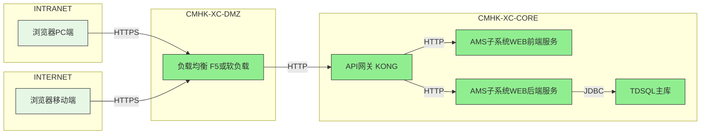

# 架构信息模型

## 系统基本信息
| 项目 | 内容 |
| --- | --- |
| 系统中文名 | 架构管理系统 |
| 系统英文名 | ams |
| 子系统中文名 | 架构管理系统子系统 |
| 子系统英文名 | ams |

## 技术栈信息

| 层级   | 分类           | 是否涉及 | 技术栈                | 版本     | 开源/商用 |
|--------|----------------|----------|-----------------------|----------|-----------|
| 前端   | 开发语言       | 是       | TypeScript            | 5.8+     | 开源      |
| 前端   | 开发框架       | 是       | Vue                   | 3.5+     | 开源      |
| 前端   | 开源组件       | 是       | Element Plus          | 2.10+    | 开源      |
| 前端   | 构建组件       | 是       | Vite                  | 6.3+     | 开源      |
| 前端   | 状态管理       | 是       | Pinia                 | 3.0+     | 开源      |
| 后端   | 开发语言       | 是       | Java                  | JDK 17   | 开源      |
| 后端   | 开发框架       | 是       | Spring Boot           | 3.5+     | 开源      |
| 后端   | 开源组件       | 是       | MyBatis               | 3.5+     | 开源      |
| 后端   | 开源组件       | 是       | MyBatis Plus          | 3.5+     | 开源      |
| 后端   | 开源组件       | 是       | Knife4j               | 4.5+     | 开源      |
| 后端   | 开源组件       | 是       | Lombok                | 1.18+    | 开源      |
| 后端   | 开源组件       | 是       | Fastjson2             | 2.0+     | 开源      |
| 后端   | 构建组件       | 是       | Maven                 | 3.9+     | 开源      |
| 数据库 | 关系数据库     | 是       | TDSQL                 | 8.0      | 商用      |
| 基础设施 | 容器/虚拟机   | 是       | 信创容器（K8s）       | —        | 商用      |
| 基础设施 | 操作系统      | 是       | 麒麟                  | —        | 商用      |
| 基础设施 | 芯片          | 是       | ARM（鲲鹏）           | —        | 商用      |

## 部署架构图

