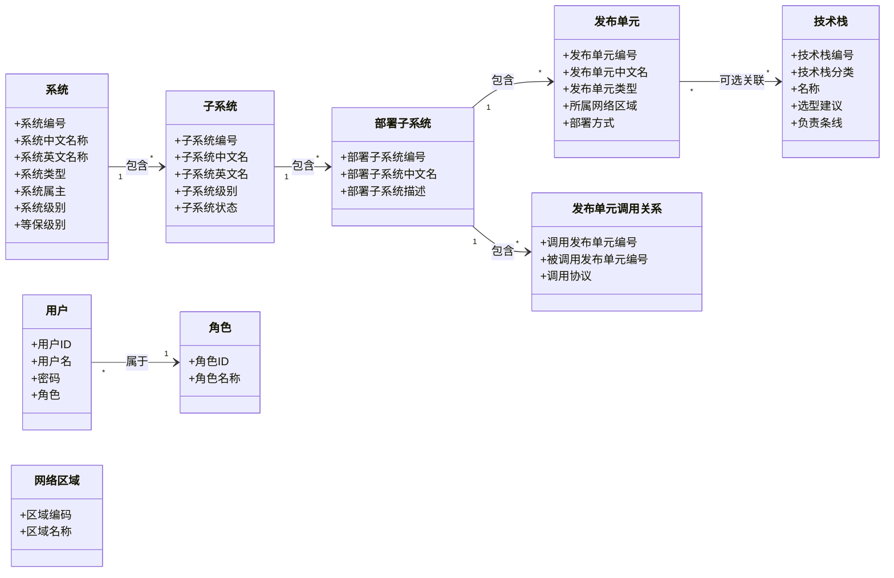
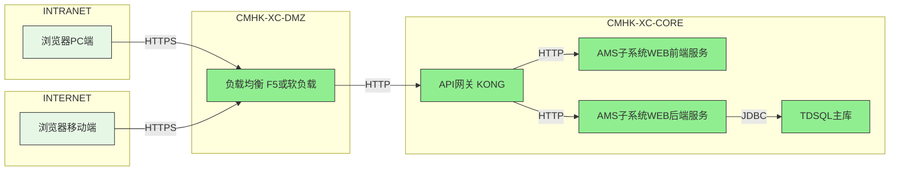
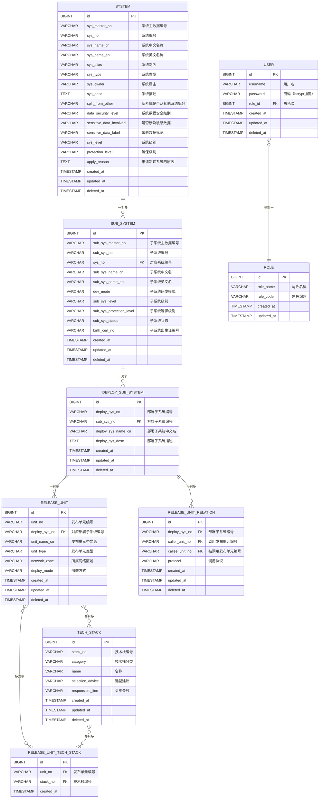

## 1. 文档概述

### 1.1 系统基本信息

| 项目 | 内容 |
| --- | --- |
| 系统中文名 | 架构管理系统 |
| 系统英文名 | ams |
| 子系统中文名 | 架构管理系统子系统 |
| 子系统英文名 | ams |

### 1.2 系统定位
#### 1.2.1 核心功能
架构管理系统（AMS）面向企业 IT 架构资产管理场景，提供系统、子系统、部署子系统、发布单元、技术栈的统一维护，支持基于 Mermaid 的逻辑部署架构图自动生成与手动调整，以及发布单元调用关系管理。系统通过 RBAC 权限模型区分超级管理员、管理员和普通用户，满足不同角色的操作与查询需求。

| **功能模块** | **功能描述及实现流程** |
| ------------ | --------------------- |
| 系统清单管理 | 对系统、子系统、部署子系统、发布单元进行增删改查，维护四级层级关系；支持 Excel 批量导入导出，已存在数据按唯一编号覆盖更新；删除时若存在下级数据则禁止删除并提示。 |
| 技术栈管理 | 对技术栈进行分类、名称、选型建议、负责条线等信息的增删改查；支持 Excel 批量导入导出；删除时若被发布单元引用则提示引用关系。 |
| 逻辑部署架构图管理 | 基于部署子系统下的发布单元、网络区域及调用关系自动生成 Mermaid 格式架构图；当前系统发布单元以绿色标识，其它系统以浅绿色标识；支持管理员手动调整节点位置与备注并持久化。 |
| 发布单元调用关系管理 | 对发布单元之间的调用关系（含协议）进行增删改查；同一部署子系统下调用方与被调用方组合为联合唯一键；被调用方删除后历史记录保留，架构图中不展示。 |
| 用户角色及权限管理 | 超级管理员可设置管理员；管理员拥有系统清单、技术栈、架构图、调用关系的增删改查权限；普通用户仅拥有查询权限；前后端双重权限控制。 |

#### 1.2.2 参考文档

| 文档名称 | 文档链接 | 关联章节 | 用途 |
|---------|--------|---------|------|
| 需求文档 | [ams-output/requirement.md](ams-output/requirement.md) | 全部 | 需求依据 |

---

## 2. 总体设计

### 2.1 系统架构总览

#### 2.1.1 领域模型



#### 2.1.2 架构视图

##### 部署视图（Physical View）



#### 2.1.3 项目目录结构

```
ams/                     # 项目根目录（前后端一体化仓库）
├── ams-web/             # 前端工程模块
│   ├── src/
│   │   ├── api/         # 后端接口请求封装
│   │   ├── assets/      # 静态资源（图片/样式/字体）
│   │   ├── components/  # 公共可复用组件
│   │   ├── layouts/     # 页面布局组件
│   │   ├── router/      # 前端路由配置
│   │   ├── stores/      # 全局状态管理（Pinia）
│   │   ├── utils/       # 前端工具函数
│   │   └── views/       # 业务页面组件
│   │       ├── system/      # 系统清单管理页面
│   │       ├── techstack/   # 技术栈管理页面
│   │       ├── diagram/     # 逻辑部署架构图页面
│   │       ├── relation/    # 调用关系管理页面
│   │       └── user/        # 用户与权限管理页面
│   ├── public/          # 静态入口资源
│   └── package.json     # 前端依赖&脚本配置
├── ams-app/             # 后端工程模块（SpringBoot单体）
│   ├── src/main/java/com/cmhk/ams/
│   │   ├── controller/      # API 接口控制层
│   │   ├── service/         # 业务逻辑层
│   │   │   └── impl/
│   │   ├── model/           # 数据模型（DO/DTO/VO）
│   │   ├── mapper/          # 数据库访问层（MyBatis）
│   │   ├── config/          # 项目配置类
│   │   ├── exception/       # 全局异常处理
│   │   ├── security/        # 认证与权限控制
│   │   └── AmsApplication.java  # 启动类
│   ├── src/main/resources/
│   │   ├── application.yml
│   │   ├── application-dev.yml
│   │   ├── application-test.yml
│   │   └── application-prod.yml
│   └── pom.xml
├── deploy/              # 自动化部署配置目录
│   └── docker/
│       ├── Dockerfile-web
│       └── Dockerfile-app
├── .gitignore
└── README.md
```

### 2.2 技术选型

| 层级   | 分类           | 是否涉及 | 技术栈                | 版本     | 开源/商用 |
|--------|----------------|----------|-----------------------|----------|-----------|
| 前端   | 开发语言       | 是       | TypeScript            | 5.8+     | 开源      |
| 前端   | 开发框架       | 是       | Vue                   | 3.5+     | 开源      |
| 前端   | 开源组件       | 是       | Element Plus          | 2.10+    | 开源      |
| 前端   | 构建组件       | 是       | Vite                  | 6.3+     | 开源      |
| 前端   | 状态管理       | 是       | Pinia                 | 3.0+     | 开源      |
| 后端   | 开发语言       | 是       | Java                  | JDK 17   | 开源      |
| 后端   | 开发框架       | 是       | Spring Boot           | 3.5+     | 开源      |
| 后端   | 开源组件       | 是       | MyBatis               | 3.5+     | 开源      |
| 后端   | 开源组件       | 是       | MyBatis Plus          | 3.5+     | 开源      |
| 后端   | 开源组件       | 是       | Knife4j               | 4.5+     | 开源      |
| 后端   | 开源组件       | 是       | Lombok                | 1.18+    | 开源      |
| 后端   | 开源组件       | 是       | Fastjson2             | 2.0+     | 开源      |
| 后端   | 构建组件       | 是       | Maven                 | 3.9+     | 开源      |
| 中间件 | 消息中间件     | 否       | —                     | —        | —         |
| 中间件 | 分布式调度     | 否       | —                     | —        | —         |
| 中间件 | 分布式配置     | 否       | —                     | —        | —         |
| 数据库 | 关系数据库     | 是       | TDSQL                 | 8.0      | 商用      |
| 数据库 | KV 数据库      | 否       | —                     | —        | —         |
| 大数据 | 计算引擎       | 否       | —                     | —        | —         |
| 大数据 | 存储引擎       | 否       | —                     | —        | —         |
| AI     | AI 框架        | 否       | —                     | —        | —         |
| 基础设施 | 容器/虚拟机   | 是       | 信创容器（K8s）       | —        | 商用      |
| 基础设施 | 操作系统      | 是       | 麒麟                  | —        | 商用      |
| 基础设施 | 芯片          | 是       | ARM（鲲鹏）           | —        | 商用      |

#### 2.3 发布单元列表

| 发布单元英文名 | 发布单元中文名 | 部署区域 | 部署模式 | 配置 | 节点数 |
| AMS-WEB | AMS前端WEB服务 | cmhk-xc-core | 信创容器 | 0.5c-1g | 1 |
| AMS-APP | AMS后端APP服务 | cmhk-xc-core | 信创容器 | 1c-2g | 2 |
| TDSQL | TDSQL数据库 | cmhk-xc-core | 虚拟机 | 4c-8g-100G | 2 |

#### 2.4 资源规划
##### 2.4.1 推导过程
1. 容量口径（系统总体）：
- 预估用户量：100 人
- 日请求量（API 总量）：按人均 50 次估算，约 5,000 次/天
- 高峰时段：4 小时
- 高峰集中度：60%
- 峰值系数：5 倍（内部管理后台，突发流量低）
- 安全冗余：30%

2. 系统峰值 QPS 计算：
- 高峰平均 QPS：5,000 * 60% / (4 * 3,600) ≈ 0.21 QPS
- 系统峰值 QPS：0.21 * 5 * 1.3 ≈ **1.4 QPS**

3. 接入层（LB / API 网关）：
复用企业云原生基础设施，不额外设计。

4. 应用服务容器：
- 部署形态：Kubernetes
- ams-app 后端总体 Pod 数：ceil(1.4 / 80) = 1，考虑基础高可用与滚动发布，取 **2 Pod**
- ams-web 前端：1 Pod 即可（无状态静态资源）
- 资源建议：
  - ams-app：requests 1c2g / Pod；limits 2c4g / Pod
  - ams-web：requests 0.5c1g / Pod；limits 1c2g / Pod

5. K8s 集群：
复用企业云原生基础设施。

6. 数据库（TDSQL）容量与规格：
业务数据为架构元数据，预计初始数据量 < 10 万条，年增长 < 5 万条。配置 4c-8g，100G 存储。

##### 2.4.2 资源需求
| 组件 | 规格/数量 | 关键依据 |
|---|---|---:|
| KONG网关 | 复用企业基础设施 | — |
| ams-web | 1 Pod（0.5c1g requests） | 静态前端服务，低计算需求 |
| ams-app | 2 Pod（1c2g requests per pod） | 峰值 1.4 QPS、基础高可用、滚动发布 |
| TDSQL | 4C 8G，100G存储 | 中小规模元数据存储 |
| 域名 | ams.cmhk.com | 按域名规范 |

---

## 3. API接口设计

### 3.1 OpenAPI对外接口
无

### 3.2 依赖的外部接口
无

---

## 4. 数据模型设计
### 4.1 架构管理系统

#### 4.1.1 数据模型



**实体说明**：

- 系统表（`systems`）

| 字段名 | 类型 | 约束/索引 | 字段说明 |
|-------|------|----------|---------|
| id | BIGINT | PK, AUTO_INCREMENT | 主键 |
| sys_master_no | VARCHAR(64) | UK(uk_systems_master_no), NOT NULL | 系统主数据编号 |
| sys_no | VARCHAR(64) | UK(uk_systems_sys_no), NOT NULL | 系统编号 |
| sys_name_cn | VARCHAR(128) | UK(uk_systems_name_cn), NOT NULL | 系统中文名称 |
| sys_name_en | VARCHAR(128) | UK(uk_systems_name_en), NOT NULL | 系统英文名称 |
| sys_alias | VARCHAR(128) | UK(uk_systems_alias) | 系统别名 |
| sys_type | VARCHAR(32) | NOT NULL | 系统类型（字典值） |
| sys_owner | VARCHAR(64) | NOT NULL | 系统属主 |
| sys_desc | TEXT | NOT NULL | 系统描述 |
| split_from_other | TINYINT(1) | DEFAULT 0 | 是否从其他系统拆分 |
| data_security_level | VARCHAR(32) | NOT NULL | 数据安全级别（字典值） |
| sensitive_data_involved | TINYINT(1) | NOT NULL | 是否涉及敏感数据 |
| sensitive_data_label | VARCHAR(128) | NULL | 敏感数据标记 |
| sys_level | VARCHAR(32) | NOT NULL | 系统级别（字典值） |
| protection_level | VARCHAR(32) | NOT NULL | 等保级别（字典值） |
| apply_reason | TEXT | NULL | 申请新建系统的原因 |
| created_at | TIMESTAMP | DEFAULT CURRENT_TIMESTAMP, NOT NULL | 创建时间 |
| updated_at | TIMESTAMP | DEFAULT CURRENT_TIMESTAMP ON UPDATE CURRENT_TIMESTAMP, NOT NULL | 更新时间 |
| deleted_at | TIMESTAMP | NULL | 软删除标记 |

- 子系统表（`sub_systems`）

| 字段名 | 类型 | 约束/索引 | 字段说明 |
|-------|------|----------|---------|
| id | BIGINT | PK, AUTO_INCREMENT | 主键 |
| sub_sys_master_no | VARCHAR(64) | UK(uk_sub_systems_master_no), NOT NULL | 子系统主数据编号 |
| sub_sys_no | VARCHAR(64) | UK(uk_sub_systems_no), NOT NULL | 子系统编号 |
| sys_no | VARCHAR(64) | FK(fk_sub_systems_sys), NOT NULL | 对应系统编号 |
| sub_sys_name_cn | VARCHAR(128) | UK(uk_sub_systems_name_cn), NOT NULL | 子系统中文名 |
| sub_sys_name_en | VARCHAR(128) | UK(uk_sub_systems_name_en), NOT NULL | 子系统英文名 |
| dev_mode | VARCHAR(32) | NOT NULL | 研发模式（字典值） |
| sub_sys_level | VARCHAR(32) | NOT NULL | 子系统级别（字典值） |
| sub_sys_protection_level | VARCHAR(32) | NOT NULL | 等保级别（字典值） |
| sub_sys_status | VARCHAR(32) | NOT NULL | 状态（字典值） |
| birth_cert_no | VARCHAR(64) | NOT NULL | 出生证编号 |
| created_at | TIMESTAMP | DEFAULT CURRENT_TIMESTAMP, NOT NULL | 创建时间 |
| updated_at | TIMESTAMP | DEFAULT CURRENT_TIMESTAMP ON UPDATE CURRENT_TIMESTAMP, NOT NULL | 更新时间 |
| deleted_at | TIMESTAMP | NULL | 软删除标记 |

- 部署子系统表（`deploy_sub_systems`）

| 字段名 | 类型 | 约束/索引 | 字段说明 |
|-------|------|----------|---------|
| id | BIGINT | PK, AUTO_INCREMENT | 主键 |
| deploy_sys_no | VARCHAR(64) | UK(uk_deploy_sys_no), NOT NULL | 部署子系统编号 |
| sub_sys_no | VARCHAR(64) | FK(fk_deploy_sub_sys), NOT NULL | 对应子系统编号 |
| deploy_sys_name_cn | VARCHAR(128) | UK(uk_deploy_sys_name_cn), NOT NULL | 部署子系统中文名 |
| deploy_sys_desc | TEXT | NOT NULL | 部署子系统描述 |
| created_at | TIMESTAMP | DEFAULT CURRENT_TIMESTAMP, NOT NULL | 创建时间 |
| updated_at | TIMESTAMP | DEFAULT CURRENT_TIMESTAMP ON UPDATE CURRENT_TIMESTAMP, NOT NULL | 更新时间 |
| deleted_at | TIMESTAMP | NULL | 软删除标记 |

- 发布单元表（`release_units`）

| 字段名 | 类型 | 约束/索引 | 字段说明 |
|-------|------|----------|---------|
| id | BIGINT | PK, AUTO_INCREMENT | 主键 |
| unit_no | VARCHAR(64) | UK(uk_release_unit_no), NOT NULL | 发布单元编号 |
| deploy_sys_no | VARCHAR(64) | FK(fk_release_unit_deploy_sys), NOT NULL | 对应部署子系统编号 |
| unit_name_cn | VARCHAR(128) | UK(uk_release_unit_name_cn), NOT NULL | 发布单元中文名 |
| unit_type | VARCHAR(64) | NOT NULL | 发布单元类型 |
| network_zone | VARCHAR(32) | NOT NULL | 所属网络区域（字典值） |
| deploy_mode | VARCHAR(32) | NOT NULL | 部署方式 |
| created_at | TIMESTAMP | DEFAULT CURRENT_TIMESTAMP, NOT NULL | 创建时间 |
| updated_at | TIMESTAMP | DEFAULT CURRENT_TIMESTAMP ON UPDATE CURRENT_TIMESTAMP, NOT NULL | 更新时间 |
| deleted_at | TIMESTAMP | NULL | 软删除标记 |

- 技术栈表（`tech_stacks`）

| 字段名 | 类型 | 约束/索引 | 字段说明 |
|-------|------|----------|---------|
| id | BIGINT | PK, AUTO_INCREMENT | 主键 |
| stack_no | VARCHAR(64) | UK(uk_tech_stack_no), NOT NULL | 技术栈编号 |
| category | VARCHAR(64) | NOT NULL | 技术栈分类 |
| name | VARCHAR(128) | UK(uk_tech_stack_name), NOT NULL | 名称 |
| selection_advice | VARCHAR(32) | NOT NULL | 选型建议（字典值） |
| responsible_line | VARCHAR(32) | NOT NULL | 负责条线（字典值） |
| created_at | TIMESTAMP | DEFAULT CURRENT_TIMESTAMP, NOT NULL | 创建时间 |
| updated_at | TIMESTAMP | DEFAULT CURRENT_TIMESTAMP ON UPDATE CURRENT_TIMESTAMP, NOT NULL | 更新时间 |
| deleted_at | TIMESTAMP | NULL | 软删除标记 |

- 发布单元技术栈关联表（`release_unit_tech_stack`）

| 字段名 | 类型 | 约束/索引 | 字段说明 |
|-------|------|----------|---------|
| id | BIGINT | PK, AUTO_INCREMENT | 主键 |
| unit_no | VARCHAR(64) | FK(fk_ruts_unit), NOT NULL | 发布单元编号 |
| stack_no | VARCHAR(64) | FK(fk_ruts_stack), NOT NULL | 技术栈编号 |
| created_at | TIMESTAMP | DEFAULT CURRENT_TIMESTAMP, NOT NULL | 创建时间 |

- 发布单元调用关系表（`release_unit_relations`）

| 字段名 | 类型 | 约束/索引 | 字段说明 |
|-------|------|----------|---------|
| id | BIGINT | PK, AUTO_INCREMENT | 主键 |
| deploy_sys_no | VARCHAR(64) | UK(uk_relations_deploy_caller_callee), NOT NULL | 部署子系统编号 |
| caller_unit_no | VARCHAR(64) | UK(uk_relations_deploy_caller_callee), NOT NULL | 调用发布单元编号 |
| callee_unit_no | VARCHAR(64) | UK(uk_relations_deploy_caller_callee), NOT NULL | 被调用发布单元编号 |
| protocol | VARCHAR(16) | NOT NULL | 调用协议 |
| created_at | TIMESTAMP | DEFAULT CURRENT_TIMESTAMP, NOT NULL | 创建时间 |
| updated_at | TIMESTAMP | DEFAULT CURRENT_TIMESTAMP ON UPDATE CURRENT_TIMESTAMP, NOT NULL | 更新时间 |
| deleted_at | TIMESTAMP | NULL | 软删除标记 |

**约束说明**：`deploy_sys_no`、`caller_unit_no`、`callee_unit_no` 三字段组成联合唯一索引。

- 用户表（`users`）

| 字段名 | 类型 | 约束/索引 | 字段说明 |
|-------|------|----------|---------|
| id | BIGINT | PK, AUTO_INCREMENT | 主键 |
| username | VARCHAR(64) | UK(uk_users_username), NOT NULL | 用户名 |
| password | VARCHAR(128) | NOT NULL | 密码（bcrypt哈希） |
| role_id | BIGINT | FK(fk_users_role), NOT NULL | 角色ID |
| created_at | TIMESTAMP | DEFAULT CURRENT_TIMESTAMP, NOT NULL | 创建时间 |
| updated_at | TIMESTAMP | DEFAULT CURRENT_TIMESTAMP ON UPDATE CURRENT_TIMESTAMP, NOT NULL | 更新时间 |
| deleted_at | TIMESTAMP | NULL | 软删除标记 |

- 角色表（`roles`）

| 字段名 | 类型 | 约束/索引 | 字段说明 |
|-------|------|----------|---------|
| id | BIGINT | PK, AUTO_INCREMENT | 主键 |
| role_name | VARCHAR(32) | NOT NULL | 角色名称 |
| role_code | VARCHAR(32) | UK(uk_roles_code), NOT NULL | 角色编码 |
| created_at | TIMESTAMP | DEFAULT CURRENT_TIMESTAMP, NOT NULL | 创建时间 |
| updated_at | TIMESTAMP | DEFAULT CURRENT_TIMESTAMP ON UPDATE CURRENT_TIMESTAMP, NOT NULL | 更新时间 |

---

## 5. 系统集成

### 5.1 系统整体架构图
见 2.1.2 部署视图。

### 5.2 集成方式

#### 5.2.1 NUC集成
无（本次采用系统自有账号密码登录，未接入NUC。后续如需SSO/LDAP可作为二期扩展。）

#### 5.2.2 招商随行集成
无（本次为浏览器直接访问的Web管理后台，未接入招商随行。）

#### 5.3 信创容器集成

- 前端Dockerfile：
```
FROM registry-c.cmft.com/base/nginx:latest

RUN rm -rf /etc/nginx/conf.d/default.conf

RUN rm -rf /etc/nginx/conf.d/nginx.conf

ADD nginx.conf /etc/nginx/conf.d/nginx.conf

ADD dist /app/html

ADD 50x.html /app/html

ADD 404.html /app/html
```

- 后端Dockerfile:
```
FROM registry-c.cmft.com/cmhk-grd-paas-portal-public/openjdk:17
WORKDIR /app
COPY target/ams-app-1.0.0.jar app.jar
EXPOSE 8080
ENTRYPOINT ["java", "-jar", "app.jar"]
```

---

## 6. 非功能设计

### 6.1 安全要求
1. 建立 RBAC 权限控制模型，区分超级管理员、管理员、普通用户，并对关键操作留有审计日志。
2. 密码使用 bcrypt 单向哈希存储；禁止明文存储或传输。
3. 所有接口默认需要认证，公开白名单仅限登录相关接口。
4. 服务端执行完整的输入校验，防止 SQL 注入（参数化查询）和 XSS（输出转义）。
5. 文件上传校验类型与大小，禁止路径穿越。

| 参数                     | 本系统情况   |
|--------------------------|--------------|
| 是否有安全协议和安全接口 | HTTPS        |
| 身份鉴别方式             | 自有账号密码 + Session/Token |
| 是否涉及数据加密         | 是（密码哈希） |
| 是否有敏感数据           | 是（密码、等保级别） |
| 敏感数据字段             | password、data_security_level、protection_level |
| 是否个人信息收集         | 否           |
| 隐私协议                 | 无           |

### 6.2 性能指标
| 参数                     | 内容                                   |
|--------------------------|----------------------------------------|
| 平均在线用户数           | 20                                     |
| 平均用户并发量           | < 100（需求明确）                      |
| 核心 API 接口响应时间    | 普通查询 < 2s；复杂操作（批量导入、架构图生成）< 5s |
| 数据年增长量             | < 5 万条                               |

### 6.3 监控方案
系统提供存活探针与就绪探针：
- Liveness：`GET /health/live`
- Readiness：`GET /health/ready`

### 6.4 日志方案
1. 按企业日志规范记录关键业务节点（增删改操作）及异常信息。
2. 操作日志保留 90 天（需求明确）。
3. ERROR 级别日志包含完整堆栈；生产环境默认 INFO。
4. 禁止在日志中记录密码、Token 等敏感信息。

### 6.5 灾备方案
无（NFR-006 明确默认允许计划内停机，不要求高可用架构。TDSQL 主从同步由数据库基础设施层保障。）

## 7. 变更记录

| 版本号 | 变更日期   | 变更人 | 变更类型       | 变更内容                     |
|--------|------------|--------|----------------|----------------------------------|
| V1.0   | 2025-05-30 | —      | 新建系统           | 完成架构文档初稿编写             |