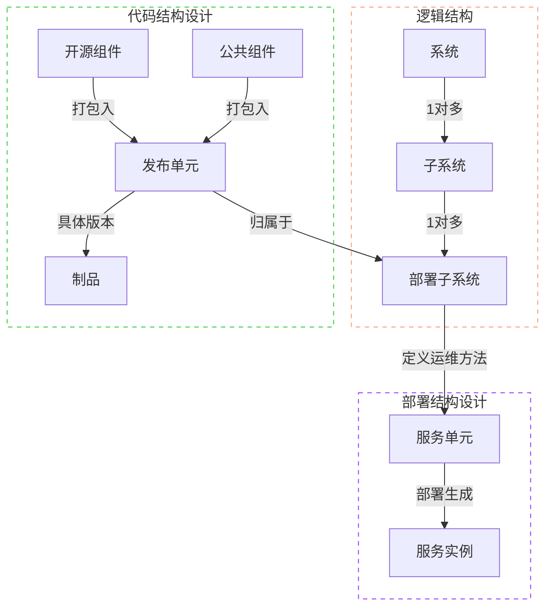
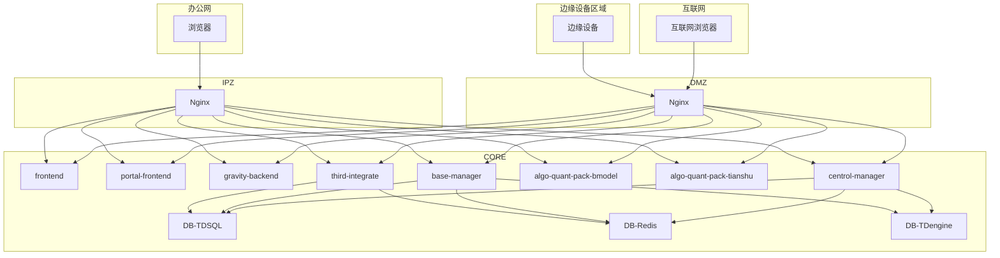
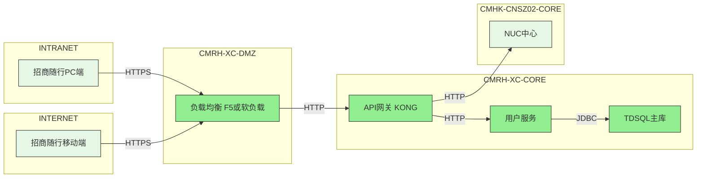

# 架构管理系统需求

### 系统清单管理

**需求1：**

（1） 对系统、子系统、部署子系统、发布单元进行增删改查的管理（字段信息见附录），四者对应关系如下

系统对象关系图及定义

| 系统对象 | 标准定义 |
| :--- | :--- |
| **系统** | 将业务功能内聚且处理过程中联系比较紧密的业务划分在一起，由软件和硬件等 IT 设施组成的一种集成体系结构。出于管理目的设置的**逻辑概念** |
| **子系统** | 子系统为最终用户、系统内其它 IT 子系统或其它 IT 系统提供一个或一组具体功能。简单划分说明：由前端+后端+独立关系型数据库 或者 后端+独立关系型数据库组成 |
| **部署子系统** | 子系统下的一种逻辑概念，一套完整部署为一个部署子系统。如信创环境部署的某个子系统。 |
| **发布单元** | 在物理上，发布单元通常呈现为 war、包含 main 函数的 jar、exe 等可执行文件类型；发布单元还包含正确启动所需的依赖组件（库文件）。 |

（2） 查询功能如下：
* **系统**：可通过系统主数据编号、系统编号、中文名称、英文名称、类型、属主、系统级别、等保级别等字段进行查询
* **子系统**：可通过系统编号、子系统编号、子系统主数据编号、中文名称、英文名称、业务部门、子系统级别等字段进行查询
* **部署子系统**：可通过系统编号、子系统编号、子系统主数据编号、部署子系统编号、中文名称、英文名称等字段进行查询
* **发布单元**：可通过系统编号、子系统编号、子系统主数据编号、部署子系统编号、发布单元编号、中文名称、英文名称、类型、部署方式等字段进行查询

**需求2：**
* 可以通过excel的方式导入导出系统、子系统、部署子系统、发布单元。
* 支持导出按指定条件查询的结果，查询条件见需求1

---

### 技术栈管理

**需求1：**
* 对技术栈进行增删改查的管理（字段信息见附录）
* 可通过技术栈编号、分类、名称、选型建议、负责条线等字段进行查询

**需求2： 以excel的方式导入导出技术栈**
* 可以通过excel的方式导入导出技术栈。
* 支持导出按指定条件查询的结果，查询条件见需求1

---

### 逻辑部署架构图管理

**需求1：**
* 对部署子系统的逻辑部署架构图进行展示（可基于mermaid格式形成初版，后期再优化为原版模式），图中需要包含网络区域、发布单元名称、发布单元调用关系等

**Mermaid语法示例：**

**生成的逻辑架构图示例：**

* 对发布单元之间的调用关系进行增删改查管理，调用关系字段信息见附录

---

### 系统用户角色及权限

* **超级管理员**：可以设置管理员，并拥有系统所有权限
* **管理员**：可以对系统清单、技术栈、逻辑部署架构图进行增删改查
* **普通用户**：可以查询系统清单、技术栈信息、子系统发布单元、子系统逻辑部署架构图

---

## 附录：

### 系统信息

| 小类 | 字段 | 是否主键 | 是否唯一 | 是否必填 | 说明 |
| :--- | :--- | :--- | :--- | :--- | :--- |
| 主数据 | 系统主数据编号 | | 是 | 是 | 系统在主数据平台的编号，首次架构评审时，向主数据平台申请的编号 |
| 系统信息 | 系统编号 | 是 | 是 | 是 | 系统在架构管理系统中的编号 |
| | 系统中文名称 | | 是 | 是 | 系统中文名称 |
| | 系统英文名称 | | 是 | 是 | 系统英文名称,缩写,非全称 |
| | 系统别名 | | 是 | | 系统别名 |
| | 系统类型 | | | 是 | 综合办公，经营管理，生产运营，维护在数据字典中 |
| 业务信息 | 系统属主 | | | 是 | 系统归属的业务部门 |
| | 系统描述 | | | 是 | 系统定位及功能描述 |
| | 新系统是否从其他系统拆分 | | | | 新系统是否从其他系统拆分，是/否 |
| 数据 | 系统数据安全级别 | | | 是 | 非涉密，秘密，机密，绝密，维护在数据字典中 |
| | 是否涉及敏感数据 | | | 是 | 是/否 |
| | 敏感数据标记 | | | | 自定义 |
| 安全 | 系统级别 | | | 是 | 核心/重要/一般，维护在数据字典中 |
| | 等保级别 | | | 是 | 按照国家规定，1-5级，维护在数据字典中 |
| 架构 | 申请新建系统的原因 | | | | 申请新建系统的原因，新系统架构评审用 |

### 子系统信息

| 小类 | 字段 | 是否主键 | 是否唯一 | 是否必填 | 说明 |
| :--- | :--- | :--- | :--- | :--- | :--- |
| 主数据 | 子系统主数据编号 | | 是 | 是 | 子系统在主数据平台的编号 |
| 子系统信息 | 子系统编号 | 是 | 是 | 是 | 子系统在架构管理系统中的编号 |
| | 子系统对应系统编号 | | | 是 | 关联系统在架构管理系统中的编号 |
| | 子系统中文名 | | 是 | 是 | 子系统中文名 |
| | 子系统英文名 | | 是 | 是 | 子系统英文名 |
| 研发 | 子系统研发模式 | | | 是 | 自研、采购、采购+自研 |
| 安全 | 子系统级别 | | | 是 | 核心/重要/一般 |
| 安全 | 子系统等保级别 | | | 是 | 1/2/3/4/5级 |
| 运维 | 子系统状态 | | | 是 | 待上线，已上线，已下线等 |
| 出生证 | 子系统“出生证”编号 | | | 是 | 系统自动生成 |

### 部署子系统信息

| 小类 | 字段 | 是否主键 | 是否唯一 | 是否必填 | 说明 |
| :--- | :--- | :--- | :--- | :--- | :--- |
| 部署子系统信息 | 部署子系统编号 | 是 | 是 | 是 | 部署子系统在架构管理系统中的编号 |
| | 对应子系统编号 | | | 是 | 关联子系统在架构管理系统中的编号 |
| | 部署子系统中文名 | | 是 | 是 | 部署子系统中文名 |
| | 部署子系统描述 | | | 是 | 部署子系统定位及功能描述 |

### 发布单元信息

| 小类 | 字段 | 是否主键 | 是否唯一 | 是否必填 | 说明 |
| :--- | :--- | :--- | :--- | :--- | :--- |
| 发布单元信息 | 发布单元编号 | 是 | 是 | 是 | 发布单元在架构管理系统中的编号 |
| | 对应部署子系统编号 | | | 是 | 对应部署子系统的编号 |
| | 发布单元中文名 | | 是 | 是 | 发布单元中文名 |
| | 发布单元类型 | | | 是 | 如NGINX、TOMCAT等 |
| | 所属网络区域 | | | 是 | 如互联网、办公网等 |
| | 部署方式 | | | 是 | 如虚机、容器等 |

### 网络区域说明

| 网络区域 | 说明 |
| :--- | :--- |
| INTERNET | 代表互联网应用访问 |
| INTRANET | 代表办公网应用访问 |
| DMZ区 | 互联网隔离区 |
| IPZ区 | 内网DMZ |
| CORE区 | 核心业务区 |
| PTR区 | 合作伙伴区 |

### 技术栈信息

| 小类 | 字段 | 是否主键 | 是否唯一 | 是否必填 | 说明 |
| :--- | :--- | :--- | :--- | :--- | :--- |
| 技术栈信息 | 技术栈编号 | 是 | 是 | 是 | 技术栈在架构管理系统中的编号 |
| | 技术栈分类 | | | 是 | 前端、后端、人工智能等 |
| | 名称 | | 是 | 是 | 技术栈名称 |
| | 选型建议 | | | 是 | 推荐/管控/禁止/试点使用等 |
| | 负责条线 | | | 是 | 应用线/数据线/AI线/技术平台线 |

### 发布单元调用关系

| 小类 | 字段 | 是否主键 | 是否唯一 | 是否必填 | 说明 |
| :--- | :--- | :--- | :--- | :--- | :--- |
| 发布单元调用关系 | 部署子系统编号 | 联合主键 | | 是 | |
| | 调用发布单元编号 | | | 是 | |
| | 被调用发布单元编号 | | | 是 | |
| | 调用协议 | | | 是 | http/tcp等 |
